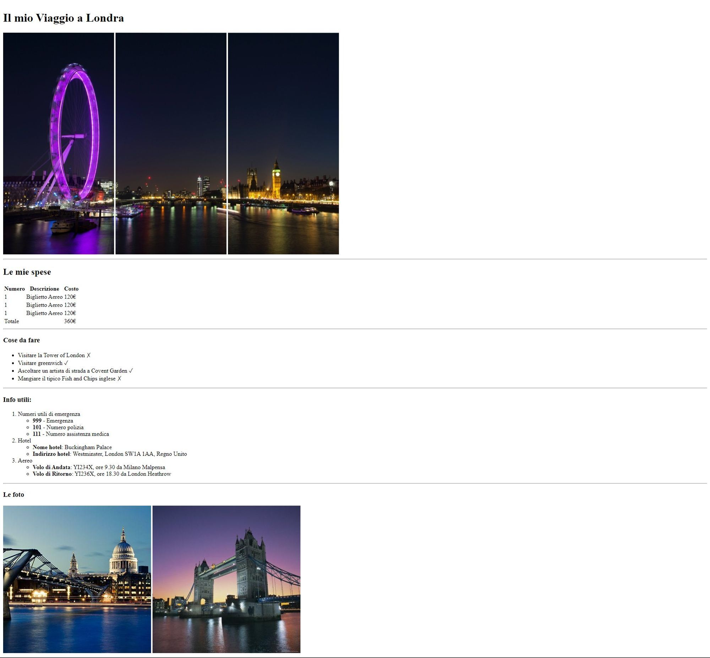

# Viaggio a Londra

Questo progetto è tratto dalla prima esercitazione su HTML del corso Boolean in Full-Stack Web Development e descrive un viaggio sotto forma di pagina Web allo scopo di far utilizzare agli studenti (compreso il sottoscritto) i tag più semplici e usati da questo linguaggio.
La foto seguente è quella da ricreare per l'esercizio:
